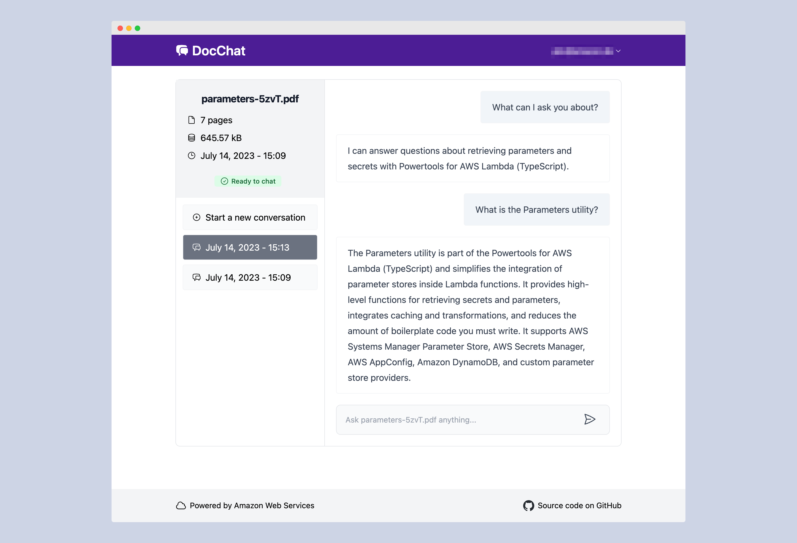

# Serverless Document Chat Application

This application allows users to ask natural language questions of any PDF document they upload. I've fully developed this solution to combine text generation and analysis capabilities of an LLM with a vector search of the document content. It leverages serverless services such as [Amazon Bedrock](https://aws.amazon.com/bedrock/) for accessing foundational models, [AWS Lambda](https://aws.amazon.com/lambda/) to run [LangChain](https://github.com/hwchase17/langchain), and [Amazon DynamoDB](https://aws.amazon.com/dynamodb/) for maintaining conversational memory.

<p float="left">
  
  
</p>

> **Note**
> This project incurs AWS costs. Refer to [AWS Pricing](https://aws.amazon.com/pricing/) for more details.

## Key Features

- [Amazon Bedrock](https://aws.amazon.com/bedrock/) for serverless embeddings and inference.
- [LangChain](https://github.com/hwchase17/langchain) to orchestrate a Q&A LLM chain.
- [FAISS](https://github.com/facebookresearch/faiss) for vector storage.
- [Amazon DynamoDB](https://aws.amazon.com/dynamodb/) for serverless conversational memory.
- [AWS Lambda](https://aws.amazon.com/lambda/) for serverless compute.
- Frontend built with [React](https://react.dev/), [TypeScript](https://www.typescriptlang.org/), [TailwindCSS](https://tailwindcss.com/), and [Vite](https://vitejs.dev/).
- Local run support and deployment options with [AWS Amplify Hosting](https://aws.amazon.com/amplify/hosting/).
- [Amazon Cognito](https://aws.amazon.com/cognito/) for authentication.

## How It Works


1. A user uploads a PDF document through a static web frontend into an [Amazon S3](https://aws.amazon.com/s3/) bucket.
2. The upload triggers metadata extraction and document embedding, converting text to vectors for storage in S3.
3. When a user chats with a PDF document, a Lambda function retrieves relevant vector data and provides an intelligent response using an LLM.

## Deployment Instructions

### Prerequisites

- [AWS SAM CLI](https://docs.aws.amazon.com/serverless-application-model/latest/developerguide/install-sam-cli.html)
- [Python](https://www.python.org/) 3.11 or later

### Setup and Configuration

1. Clone this repository:

   ```bash
   git clone https://github.com/mhrjdv/doc-chat.git
   ```

2. Configure Amazon Bedrock model and region parameters in `backend/src/generate_response/main.py` and `backend/src/generate_embeddings/main.py` to customize models if desired.

3. Update IAM permissions to allow model access in your preferred region:

   ```yaml
   GenerateResponseFunction:
     Type: AWS::Serverless::Function
     Properties:
       Policies:
         - Statement:
             - Sid: "BedrockScopedAccess"
               Effect: "Allow"
               Action: "bedrock:InvokeModel"
               Resource:
                 - "arn:aws:bedrock:*::foundation-model/anthropic.claude-3-haiku"
                 - "arn:aws:bedrock:*::foundation-model/amazon.titan-embed-text-v1"
   ```

4. **Build and Deploy the Application**:

   ```bash
   cd backend
   sam build
   sam deploy --guided
   ```

5. Note the output details, which include important URLs and configuration values.

### Local Frontend Setup

1. Create a `.env.development` file in the `frontend` directory with values from your deployment:

   ```plaintext
   VITE_REGION=us-east-1
   VITE_API_ENDPOINT=https://abcd1234.execute-api.us-east-1.amazonaws.com/dev/
   VITE_USER_POOL_ID=us-east-1_gxKtRocFs
   VITE_USER_POOL_CLIENT_ID=874ghcej99f8iuo0lgdpbrmi76k
   ```

2. Install frontend dependencies and start the local server:

   ```bash
   npm ci
   npm run dev
   ```

3. Access the application locally at `http://localhost:5173`.

### Optional: Deploying Frontend with Vercel

For managed deployment using Vercel Hosting by cloning GitHub Repo.

1. Delete any secrets in AWS Secrets Manager.
2. Empty the Amazon S3 bucket created for this application.
3. Run `sam delete` from the `backend` directory to remove associated resources.

## Security Considerations

While this project demonstrates serverless document chat capabilities, please review security best practices:

- Review encryption options, especially for AWS KMS, S3, and DynamoDB.
- Adjust API Gateway access logging, S3 access logging, and apply specific IAM policies as needed.
- For advanced security needs, consider connecting AWS Lambda to a VPC using the [`VpcConfig`](https://docs.aws.amazon.com/AWSCloudFormation/latest/UserGuide/aws-properties-lambda-function-vpcconfig.html) setting.

## License

This project is licensed under the MIT-0 License. See the [LICENSE](LICENSE) file for details.
